# 광명시 오픈소스 거버넌스 이니셔티브

**디지털 혁신을 통해 광명을 사회적경제·연대경제의 글로벌 수도로 전환**

## 비전

광명시는 AI, 오픈소스 거버넌스, 시민 협력 플랫폼 등 기하급수 기술을 활용하여 **디지털 전환(DX)**과 **AI 전환(AX)**을 가속화하고, **사회적경제·연대경제(SSE)**의 글로벌 모델 도시로 도약하고자 합니다.

## 주요 성과

| 성과 | 설명 |
|------|------|
| 🏆 **국무총리상 수상** | 2025년 지방자치단체 사회적경제 정책 평가 3년 연속 대상 |
| 📚 **45개 작은도서관** | 지역 밀착형 디지털 리터러시 허브 네트워크 |
| 🤝 **시민 협력 경험** | 100인 토론회, GM 주간정책회의 등 정책 공동 설계 |
| 🌐 **durume/GM 지식 모델** | 아이디어 공유 → 문서화 → Wrap-up 생애주기 |

## 왜 오픈소스 거버넌스인가?

| 효과 | 영향 |
|------|------|
| 💸 **예산 효율화** | 라이선스 비용 없이 절감분을 시민 복지에 재투자 |
| 🔎 **투명성과 신뢰** | 정책 알고리즘과 성과 지표를 코드로 공개 |
| ♻️ **확산과 재사용** | 타 도시가 성공 사례를 즉시 포크(Fork)하여 활용 |
| 🗳️ **시민 주권 실현** | 시민이 정책 공동 생산자로 성장 |

## 글로벌 벤치마크

### 공공기관 사례
- 🇰🇷 **대한민국 NIA** - 전자정부 표준 프레임워크 ([GitHub](https://github.com/eGovFramework))
- 🇬🇧 **영국 GDS** - 정부 디자인 시스템 ([GitHub](https://github.com/alphagov))
- 🇸🇬 **싱가포르 OGP** - FormSG, Isomer ([GitHub](https://github.com/opengovsg))
- 🇺🇸 **미국 code.gov** - 연방 코드 인벤토리 ([GitHub](https://github.com/GSA/code-gov))

### 국제기구·글로벌 단체
- **UNHCR** - AI 기반 난민 지원 매핑
- **World Bank** - 원조 사업 효과성 검증 ietoolkit ([GitHub](https://github.com/worldbank/ietoolkit))
- **Greenpeace** - Planet 4 시민 참여 플랫폼 ([GitHub](https://github.com/greenpeace/planet4))

## 전략 프로젝트

### 1. GM-Knowledge Repository
- 사회적경제 교육·포럼 산출물을 GitHub 공개 저장소로 전환
- Wrap-up 보고 의무화로 시행착오·성과를 표준 템플릿으로 축적
- Mermaid·다이어그램으로 정책 구조 시각화

### 2. G-SVI 오픈 데이터 고도화
- 지표 산식·측정 알고리즘을 오픈소스로 공개
- 싱가포르 OGP 벤치마킹 임팩트 대시보드 구축
- 사회적기업 자가 진단·예측 툴킷 제공

### 3. Hack for Gwangmyeong
- 사회적기업 현장 과제를 GitHub Issues로 구조화
- 시민 개발자·디자이너 상시 참여 해커톤 상설화
- 글로벌 오픈소스 도구 지역 현지화

### 4. 디지털 공유 경제 자산화
- 공유 플랫폼 코드를 오픈소스로 관리해 공동체 소유 구조 확보
- 부서 간 행정 솔루션을 이너소스로 공유
- 지역 순환 경제 전략과 디지털 자산 연계

## 6대 매칭 프로젝트

| 프로젝트 | 지역 자산 | 도구 | 기대 효과 |
|----------|----------|------|----------|
| **GitHub Townhall** | 100인 토론회, GM 주간정책회의 | Decidim | PR/Merge로 정책 심사 가시화 |
| **Gwangmyeong Food-Loop** | 그냥드림, 로컬푸드 직매장, 광명사랑화폐 | FoodCoopShop, Komunitin | 기부·잉여자원 실시간 대시보드 |
| **Open Gwangmyeong Tour** | 광명동굴, 기형도 문학관 | Arches, GitHub Pages | 시민 스토리 자동 웹 배포 |
| **Mutual Growth Data Hub** | GM 브랜드 상품, 상생 플랫폼 | Open API | 지역 기업 서비스 혁신 촉진 |
| **Open Social Impact Analytics** | G-SVI 지표, 컨설팅 데이터 | World Bank ietoolkit | 사회적 가치 계산 자동화 |
| **Autonomy Playbook** | 광명자치대학 5대 실천 프로젝트 | durume/GM 템플릿 | 타 지자체 즉시 활용 정책 매뉴얼 |

## 일자리 창출 혁명: 취업에서 창직으로

### 패러다임의 전환

> **취업하지 말고, 일자리를 만들어라.**

기존의 고용 모델은 이제 구시대의 유물입니다. 대기업의 줄어드는 일자리를 두고 경쟁하는 대신, 시민들이 AI의 힘을 빌려 사회에 필요한 서비스를 직접 만들고 **스스로 일자리를 창출**하도록 지원합니다.

### 무엇이 달라지는가

| 기존 패러다임 | 새로운 패러다임 |
|---------------|-----------------|
| 기존 일자리에 지원 | 없던 일자리를 창출 |
| 기업의 채용을 기다림 | 지역사회가 필요로 하는 서비스를 직접 구축 |
| 자원 부족으로 한계 | AI 슈퍼파워로 역량 확장 |
| 수천 명과 경쟁 | 지역 고유의 문제를 해결 |
| 기업 이익을 위해 일함 | 사회적 가치를 창출 |

### AI: 위대한 평등화 도구

과거에 의미 있는 서비스를 만들려면:
- 대규모 개발팀
- 상당한 자본 투자
- 수년간 축적된 전문성
- 기업 인프라

**이제 AI 슈퍼파워로, 한 사람이:**
- 10명의 개발자가 필요했던 애플리케이션을 구축
- 디자인 교육 없이도 전문적인 디자인 제작
- 다국어 문서를 즉시 작성
- 수개월이 걸리던 복잡한 워크플로우를 수 시간 만에 자동화
- 전례 없는 속도로 프로토타입 개발과 반복 개선

### 이전에는 불가능했던 서비스의 실현

AI는 **자원 부족으로 시도조차 어려웠던** 사회적 필요를 해결할 수 있게 합니다:

| 사회적 필요 | 왜 어려웠나 | AI가 어떻게 가능하게 하는가 |
|-------------|-------------|----------------------------|
| **노인 돌봄 조정** | 24시간 인력, 복잡한 스케줄링 필요 | AI 매칭, 자동 안부 확인, 예측 건강 알림 |
| **다국어 시민 서비스** | 비싼 번역 비용, 제한된 언어 | 100개 이상 언어 실시간 번역 |
| **소상공인 지원** | 1:1 컨설팅 비용 과다 | AI 어드바이저의 대규모 맞춤형 안내 |
| **환경 모니터링** | 센서 네트워크, 데이터 과학자 필요 | 저비용 센서 + AI 분석 = 실행 가능한 인사이트 |
| **접근성 서비스** | 전문 지식, 맞춤형 솔루션 필요 | AI 생성 편의시설, 실시간 지원 |
| **정신건강 지원** | 전문가 부족 | AI 보조 스크리닝, 24시간 위기 자원, 치료사 매칭 |

### 일자리 창출 사이클

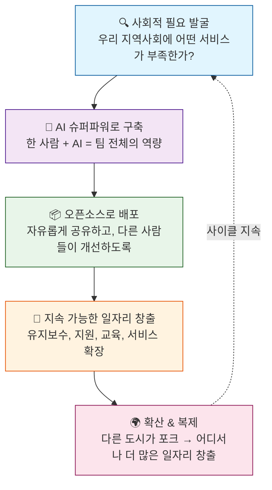

### 우리가 만들 수 있는 새로운 유형의 일자리

**서비스 창작자**
- 충족되지 않은 지역사회 필요 발굴
- AI 기반 솔루션 설계 및 구축
- 시민 피드백을 바탕으로 출시 및 개선

**AI-휴먼 브릿지 워커**
- 시민이 AI 서비스와 상호작용하도록 지원
- AI 결과물의 정확성과 적절성 확인
- 필요한 곳에 인간적 터치 제공

**오픈소스 유지관리자**
- 커뮤니티 서비스 원활한 운영 유지
- 시민 개발자들의 기여 병합
- 문서화 및 기여 방법 교육

**사회적 영향 분석가**
- 서비스의 실제 효과 측정
- 새로운 임팩트 기회 발굴
- 데이터를 정책 제안으로 연결

**커뮤니티 기술 교육자**
- 시민들에게 새로운 서비스 사용법 교육
- 다른 사람들도 창작자가 되도록 교육
- 인간적 연결로 디지털 격차 해소

### 구직자에서 창직자로

| 기존 경로 | 광명 경로 |
|----------|----------|
| 졸업 → 지원 → 대기 → 탈락/합격 | 졸업 → 필요 발굴 → 구축 → 출시 → 다른 사람 고용 |
| 성공 = 취업되는 것 | 성공 = 가치를 창출하는 것 |
| 커리어가 고용주에 의존 | 커리어가 지역사회 임팩트에 의존 |
| 스킬이 채용 공고에 맞아야 함 | 스킬이 사회적 필요에 맞춰 성장 |

### 기대 효과

- **다양한 일자리 창출** - 이전에는 "불가능"하다고 여겨졌던 분야에서
- **사회 서비스 폭발적 증가** - 이전에는 비용 문제로 해결할 수 없었던 문제 해결
- **청년 역량 강화** - 구직자에서 창직자로
- **지역사회 회복력** - 지역 문제에 대한 지역 소유 솔루션
- **혁신 문화** - 시민이 소비자가 아닌 창작자로 인식
- **글로벌 모델** - 다른 도시들이 광명의 접근법을 복제

---

## 지역공동체 자산 구축(CWB) & 사회적경제 생태계

### 오픈소스에서 지속 가능한 사회적기업으로

오픈소스 프로젝트는 영원히 무료일 필요가 없습니다. **소셜 크라우드 펀딩**을 통해 성공적인 프로젝트는 지역 시민을 고용하고 지역공동체 자산을 구축하는 지속 가능한 사회적기업으로 전환할 수 있습니다.

### 오픈소스 → 사회적기업 파이프라인

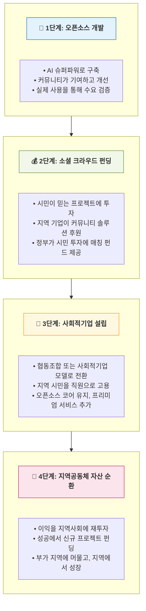

### 광명시 CWB 정책과의 연계

광명시의 지역공동체 자산 구축(CWB) 정책은 경제적 혜택을 지역사회 내에 유지하는 것을 목표로 합니다. 오픈소스 접근법은 이를 직접적으로 지원합니다:

| CWB 원칙 | 오픈소스 구현 |
|----------|--------------|
| **지역 소유** | 외부 기업이 아닌 지역 협동조합이 프로젝트 소유 |
| **지역 고용** | 광명시 주민을 고용해 서비스 유지·확장 |
| **지역 조달** | 사회적기업이 지역 공급업체에서 구매 |
| **지역 투자** | 크라우드 펀딩으로 투자 자본을 지역에 유지 |
| **지역 순환** | 광명사랑화폐를 통해 수익이 지역 경제로 순환 |

### 사회적경제 서비스 예시

#### 1. 공정거래 네트워크 플랫폼
- **오픈소스 기반**: 누구나 감사할 수 있는 투명한 마켓플레이스 코드
- **사회적기업**: 지역 생산자와 소비자를 연결하는 협동조합 운영 플랫폼
- **창출 일자리**: 플랫폼 매니저, 배송 코디네이터, 품질 검수원
- **CWB 효과**: 생산자-소비자 직거래, 공정 가격, 지역화폐 연동

#### 2. 사회적경제 지도 & 네트워크 (GM 사회적경제 지도)
- **오픈소스 기반**: 모든 사회적기업, 협동조합, 커뮤니티 조직을 보여주는 인터랙티브 지도
- **주요 기능**:
  - 카테고리, 위치, 미션별 사회적기업 검색
  - 조직 간 네트워킹 및 협력
  - 지역사회 임팩트 지표 추적
  - 주변 공정거래 제품·서비스 찾기
- **사회적기업**: 지도 유지관리, 데이터 검증, 네트워킹 이벤트
- **창출 일자리**: 데이터 큐레이터, 커뮤니티 연락 담당자, 이벤트 기획자

#### 3. 지역화폐 연동 (광명사랑화폐 연동)
- **오픈소스 기반**: 사회적경제 서비스와 지역화폐를 연결하는 API
- **사회적기업**: 거래 처리, 가맹점 온보딩
- **창출 일자리**: 기술 지원, 가맹점 관리, 부정 거래 방지
- **CWB 효과**: 모든 거래가 지역 경제 순환을 강화

#### 4. 협동조합 배달 네트워크
- **오픈소스 기반**: 경로 최적화 및 배달 관리 시스템
- **사회적기업**: 노동자 소유 배달 협동조합
- **창출 일자리**: 배달 노동자(공정 임금, 복리후생), 배차 담당자
- **CWB 효과**: 기그 이코노미 플랫폼과 경쟁하면서 노동자를 공정하게 대우

#### 5. 커뮤니티 돌봄 매칭
- **오픈소스 기반**: 노인 돌봄, 아동 돌봄, 튜터링을 위한 AI 매칭
- **사회적기업**: 돌봄 노동자 협동조합
- **창출 일자리**: 돌봄 노동자, 코디네이터, 교육 담당자
- **CWB 효과**: 양질의 돌봄 일자리가 지역에 유지, 이익은 지역에 재투자

### 소셜 크라우드 펀딩 모델

| 펀딩 소스 | 역할 | 혜택 |
|-----------|------|------|
| **시민** | 지역 프로젝트에 소액 투자 | 소유권 지분, 의결권, 지역사회 자긍심 |
| **지역 기업** | 후원 및 B2B 파트너십 | 커뮤니티 솔루션 접근, 지역 호감도 |
| **사회적기업** | 성공 프로젝트의 수익 공유 | 신규 이니셔티브를 위한 지속 가능한 펀딩 |
| **정부** | 매칭 펀드, 인프라 지원 | 시민 투자 효과 배가 |
| **광명사랑화폐** | 지역화폐 투자 옵션 | 지역화폐 생태계 강화 |

### 거버넌스: 지역사회 소유, 지역사회 운영

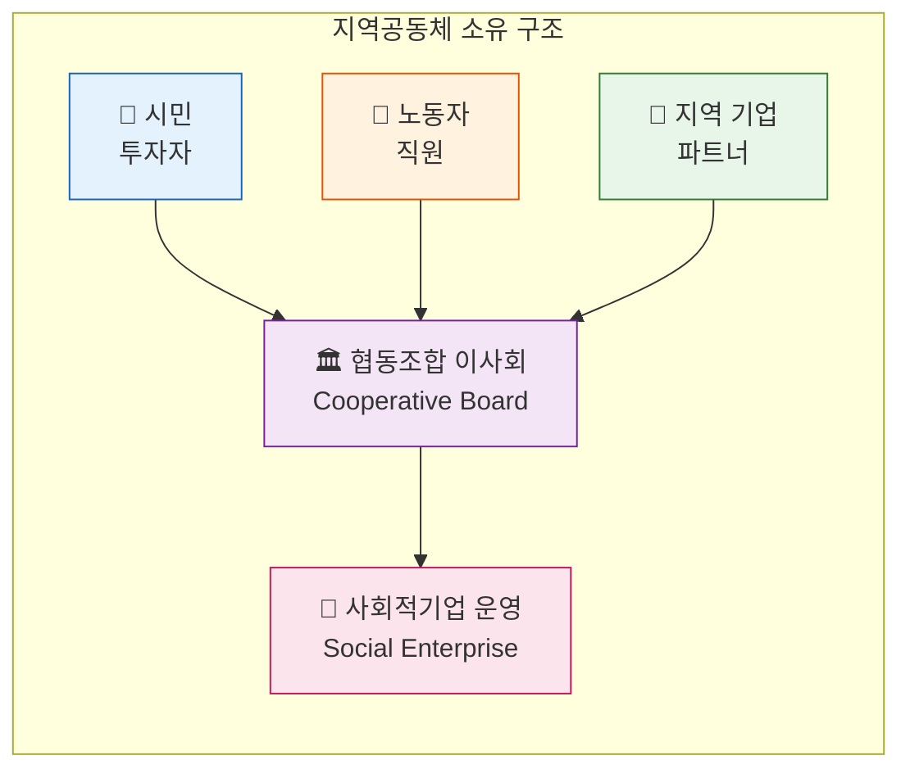

### 기대되는 CWB 성과

- **지역 일자리 창출**: 성공적인 사회적기업당 50개 이상의 지속 가능한 일자리
- **자산 지역 유지**: 수익의 80% 이상이 광명시 내에서 순환
- **시민 투자**: 시민이 소비자가 아닌 이해관계자로 참여
- **공정 경제**: 착취적 플랫폼 자본주의의 대안
- **복제 가능 모델**: 다른 도시가 코드와 비즈니스 모델 모두 포크 가능

---

## 상설위원회: 애자일 & 린 스타트업 실행

### 왜 상설위원회인가?

광명시를 사회적경제·연대경제의 글로벌 수도로 전환하려면, **빠르게 학습하고, 스마트하게 설계하며, 지속적으로 실행**할 수 있는 전담 조직이 필요합니다. 전통적인 정부 사업 주기는 기하급수 기술의 속도를 따라가기에 너무 느립니다.

### 위원회 미션

> "신속한 실험, 검증된 학습, 지속적인 반복을 통해 광명시의 디지털 및 사회적경제 전환을 가속화한다."

### 애자일 & 린 스타트업 철학

| 원칙 | 적용 |
|------|------|
| **만들기-측정-학습** | MVP를 빠르게 출시하고, 시민 피드백을 수집하며, 신속하게 반복 |
| **검증된 학습** | 본격 투자 전 가정 검증; 빠르게 실패하고, 더 빠르게 학습 |
| **피벗 또는 지속** | 프로젝트 지속, 변경, 중단에 대한 데이터 기반 의사결정 |
| **지속적 배포** | 연간 프로젝트가 아닌 정기 릴리스; 항상 개선 |
| **교차기능팀** | 시민, 개발자, 공무원, 사회적기업이 함께 협력 |

### 위원회 구조

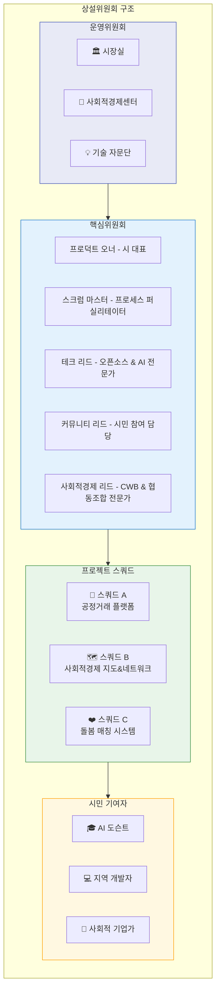

### 린 스타트업 사이클

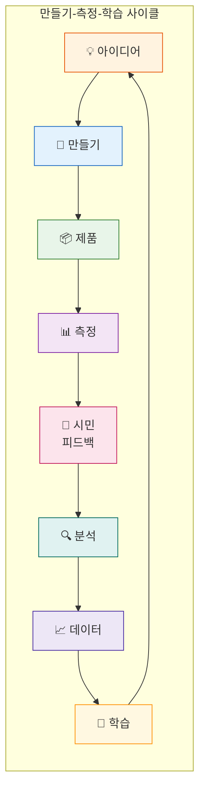

### 스프린트 리듬

| 주기 | 기간 | 활동 |
|------|------|------|
| **일일 스탠드업** | 15분 | 빠른 동기화, 장애물, 진행 상황 |
| **주간 스프린트** | 1주 | 점진적 기능 개발 및 배포 |
| **격주 데모** | 2주 | 시민에게 진행 상황 공유, 피드백 수집 |
| **월간 회고** | 1개월 | 잘된 점, 안 된 점, 개선 방법 |
| **분기 리뷰** | 3개월 | 주요 마일스톤, 피벗 결정, 로드맵 업데이트 |

### 최소 기능 제품(MVP) 접근법

완벽한 솔루션에 수년을 투자하는 대신, MVP를 출시합니다:

| 프로젝트 | MVP (1-4주) | V1.0 (2-3개월) | 확장 (4개월+) |
|----------|-------------|----------------|---------------|
| **사회적경제 지도** | 50개 항목의 정적 지도 | 인터랙티브 검색, 기본 네트워킹 | 이벤트, 리뷰 포함 전체 플랫폼 |
| **공정거래 플랫폼** | 간단한 주문 폼 + 스프레드시트 | 지역화폐 연동 기본 이커머스 | 배달 포함 전체 마켓플레이스 |
| **돌봄 매칭** | 구글 폼 + 수동 매칭 | AI 지원 매칭 프로토타입 | 전체 협동조합 운영 |

### 학습 루프

**주간 학습 세션**
- 기술 튜토리얼 (GitHub, AI 도구, 오픈소스)
- 글로벌 사회적경제 혁신 사례 연구
- 시민 피드백 분석 및 인사이트

**월간 워크숍**
- 린 스타트업 방법론 교육
- 사회 서비스를 위한 디자인 씽킹
- 오픈소스 기여 실습

**분기 해커톤**
- "Hack for Gwangmyeong" 이벤트
- 시민 아이디어 신속 프로토타이핑
- 시 리더십 대상 데모 데이

### 핵심 성과 지표(KPI)

| 카테고리 | 지표 | 목표 |
|----------|------|------|
| **속도** | 아이디어에서 MVP까지 소요 시간 | 4주 미만 |
| **학습** | 프로젝트당 시민 피드백 세션 | 월 10회 이상 |
| **반복** | 프로젝트당 월간 릴리스 | 4회 이상 (주간) |
| **채택** | 서비스당 활성 사용자 | 6개월 내 1,000명 이상 |
| **고용** | 창출된 지역 일자리 | 성공 프로젝트당 10개 이상 |
| **지속가능성** | 크라우드 펀딩 달성 프로젝트 | 연간 3개 이상 |

### 의사결정 프레임워크: 피벗 또는 지속

분기 리뷰 후 각 프로젝트를 평가합니다:

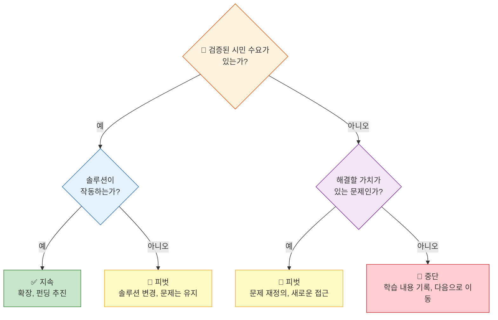

### 위원회 약속

1. **투명성**: 모든 작업을 공개 GitHub 저장소에서 진행
2. **포용성**: 모든 의사결정에 시민 참여
3. **속도**: 매주 무언가를 배포
4. **학습**: 실패는 패배가 아닌 데이터
5. **임팩트**: 산출물이 아닌 실제 성과 측정

---

## AI 도슨트 양성 프로그램

디지털 격차 해소를 위한 시민 디지털 해설사 양성:

### 미션
> "AI 도슨트는 모두가 안전하고 공정하게 AI를 활용할 수 있는 사회를 만들기 위해, 지역사회와 협력하여 AI 이해 증진, 책임 있는 사용, 디지털 포용을 실현합니다."

### 양성 프로세스
1. **Learning with AI** - 생성형 AI, GitHub 기초, 문서 작성법 학습
2. **Teaching with AI** - 인포그래픽 제작, 해설 스킬 훈련
3. **Practice & Certification** - 현장 실습 → 광명시 공인 AI 도슨트 자격 부여

### 핵심 목표
- 📚 AI 리터러시 향상
- ⚖️ 책임 있는 AI 사용 촉진
- 🤝 사회적 연대 강화
- 🌈 디지털 격차 해소

## 작은도서관: 지속 가능한 시민 참여의 핵심

### 왜 작은도서관이 이 프로젝트의 심장인가

> **이 프로젝트를 지속 가능하고 활력 있게 만드는 핵심은 시민 참여입니다. 작은도서관은 사회 변혁을 위한 동네 허브입니다.**

광명시의 45개 작은도서관은 단순히 책을 빌리는 곳이 아닙니다—모든 동네에 있는 **신뢰받는 커뮤니티 거점**입니다. 이미 갖추고 있는 것:
- 모임을 위한 물리적 공간
- 주민과의 신뢰 관계
- 지역사회를 아는 사서
- 공공 교육과 접근성의 사명

이제 이를 교육, 훈련, 구축, 지역공동체 자산 창출을 위한 **풀서비스 혁신 허브**로 전환합니다.

### 작은도서관 전환 모델

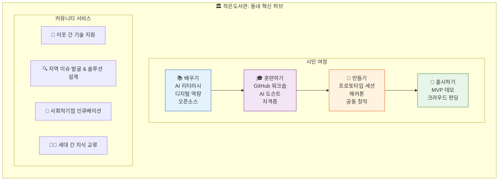

### 풀서비스 혁신 허브 모델

#### 1. 배우기(LEARN): 모두를 위한 디지털 리터러시
| 프로그램 | 대상 | 내용 |
|----------|------|------|
| **AI 첫걸음** | 시니어, 초보자 | AI란? 안전한 사용법, 실용적 활용 |
| **디지털 시민권** | 전 연령 | 온라인 안전, 정보 리터러시, 디지털 권리 |
| **오픈소스 101** | 관심 있는 시민 | 오픈소스란? 왜 중요한가? |
| **모두를 위한 GitHub** | 비개발자 | GUI 기반 기여, 이슈 등록 |

#### 2. 훈련하기(TRAIN): 역량 구축 & 자격증
| 프로그램 | 기간 | 성과 |
|----------|------|------|
| **AI 도슨트 부트캠프** | 8주 | 공인 커뮤니티 AI 가이드 |
| **오픈소스 기여자** | 4주 | 첫 GitHub 기여 |
| **사회 서비스 디자이너** | 6주 | 커뮤니티 솔루션 프로토타입 |
| **협동조합 리더십** | 4주 | 사회적기업 창업 준비 완료 |

#### 3. 만들기(BUILD): 공동 창작 & 프로토타이핑
- **주간 빌드 세션**: 주민들이 함께 지역 프로젝트 작업
- **동네 해커톤**: 24시간 집중 문제 해결 이벤트
- **청년-시니어 페어링**: 세대 간 팀으로 지혜와 기술 역량 결합
- **MVP 워크숍**: 주말에 아이디어를 작동하는 프로토타입으로

#### 4. 출시하기(LAUNCH): 아이디어에서 임팩트로
- **데모 데이**: 커뮤니티와 시 공무원에게 프로젝트 발표
- **크라우드 펀딩 캠페인**: 지역 투자 드라이브 시작
- **사회적기업 설립**: 도서관에서 협동조합으로 졸업
- **지속적 지원**: 출시 후에도 도서관이 홈 베이스

### 사서의 혁신 퍼실리테이터 전환

사서는 도서 관리자에서 **커뮤니티 혁신 촉매자**로 전환합니다:

| 기존 역할 | 새로운 역할 |
|----------|------------|
| 도서 대출 | 학습 여정 퍼실리테이팅 |
| 조용한 학습 공간 | 협력적 창작 공간 |
| 정보 검색 | 문제 해결 안내 |
| 개별 서비스 | 커뮤니티 빌딩 |
| 수동적 자원 | 능동적 혁신 파트너 |

### 네트워크 효과: 45개 도서관 = 45개 혁신 노드

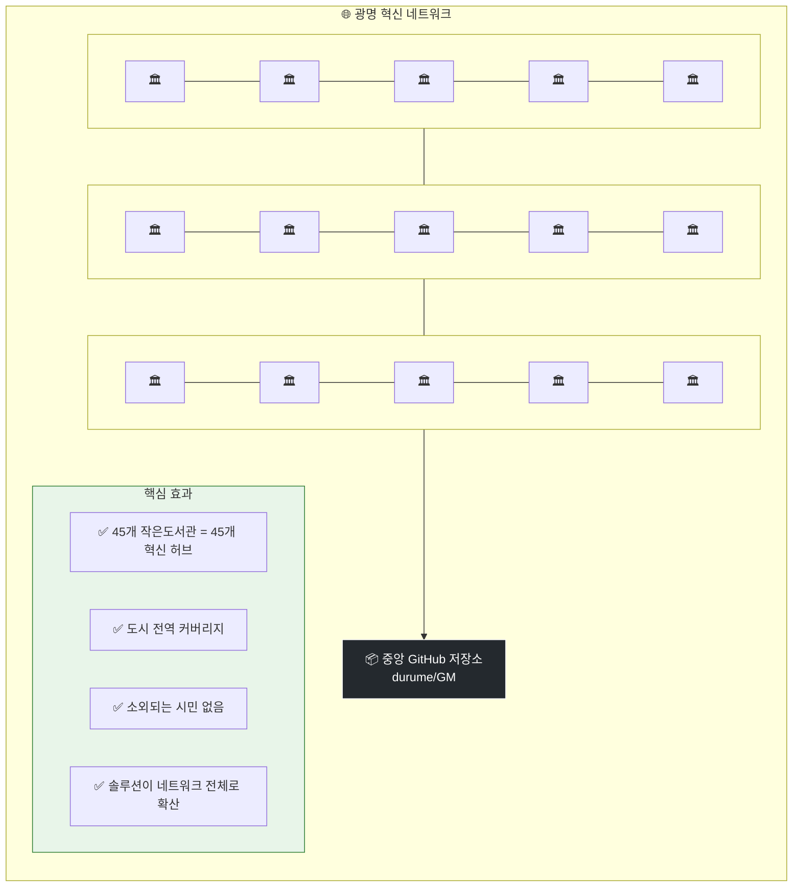

### 왜 이것이 프로젝트를 지속 가능하게 만드는가

| 도전 | 작은도서관의 해결 방식 |
|------|----------------------|
| **모든 시민에게 도달** | 도서관은 모든 동네에 있고, 이미 신뢰받음 |
| **지속적 참여** | 일회성 이벤트가 아닌 상시 프로그램 |
| **세대 간 참여** | 모든 연령의 자연스러운 모임 장소 |
| **낮은 진입 장벽** | 무료, 친숙하고 부담 없는 환경 |
| **지역 소유** | 각 도서관이 동네의 필요를 반영 |
| **자원봉사 기반** | 도서관 자원봉사자가 혁신 대사로 |
| **물리적 + 디지털** | 온라인 도구와 오프라인 커뮤니티의 가교 |

### 도서관 네트워크를 통한 시민 여정

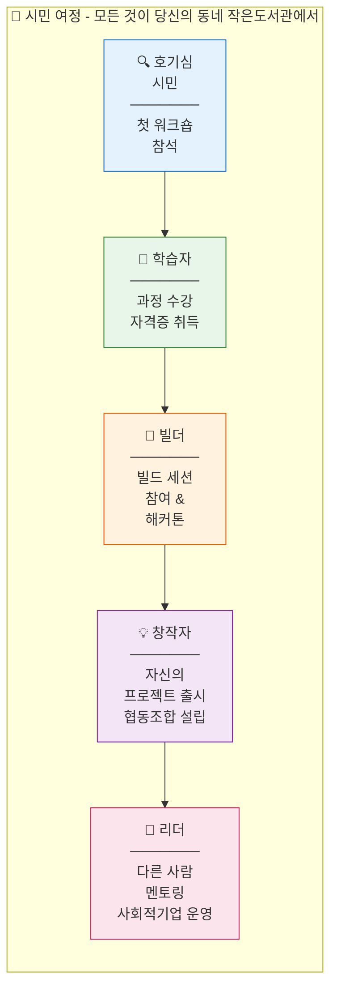

### 도서관 임팩트 측정

| 지표 | 목표 (1년차) |
|------|-------------|
| 혁신 허브로 활성화된 도서관 | 45개 (100%) |
| 프로그램 참여 시민 | 5,000명 이상 |
| AI 도슨트 자격증 취득 | 200명 이상 |
| 인큐베이팅된 프로젝트 | 50개 이상 |
| 출시된 사회적기업 | 10개 이상 |
| 도서관 네트워크를 통해 창출된 일자리 | 100개 이상 |

---

## 청년의 마음 지키기: 온라인 급진화의 대안

### 숨겨진 위기

청년 남성들이 점점 더 극우 이념에 노출되고 있습니다:
- **게임 커뮤니티**에서 무분별하게 퍼지는 극단적 관점
- **숏폼 클립의 알고리즘**이 설계적으로 급진화를 유도
- **소속감을 제공하지만** 결국 고립과 분노로 이끄는 온라인 공간
- **목적 부재**가 극단주의 서사를 매력적으로 만듦

이것은 단순한 정치적 문제가 아닙니다—**정신 건강 위기**이자 **사회적 비상사태**입니다.

### 왜 이런 일이 발생하는가

| 청년들이 원하는 것 | 알고리즘이 제공하는 것 | 실제로 필요한 것 |
|-------------------|---------------------|-----------------|
| 소속감 | 독성 온라인 커뮤니티 | 실제 세계의 연결 |
| 목적 | 분노와 불만의 서사 | 의미 있는 기여 |
| 숙달감 | 끝없는 소비 루프 | 실제 역량 구축 |
| 인정 | 좋아요와 참여 지표 | 진정한 성취 |
| 정체성 | 우리 vs. 그들 부족주의 | 지역사회에서의 긍정적 역할 |

### 이 프로젝트가 제공하는 건강한 대안

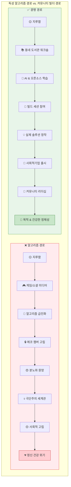

### 알고리즘 대신 우리가 제공하는 것

| 독성 온라인이 제공하는 것 | 우리 프로젝트가 제공하는 것 |
|-------------------------|--------------------------|
| **가짜 숙달감** (게임 랭크) | **진짜 숙달감** (실제 앱 개발) |
| **준사회적 관계** | **실제 우정** (동료 빌더들과) |
| **분노 콘텐츠** | **건설적 문제 해결** |
| **수동적 소비** | **능동적 창작** |
| **가상 성취** | **실질적 지역사회 임팩트** |
| **익명 트롤링** | **기여에 대한 공개 인정** |
| **불만 서사** | **행동을 통한 역량 강화** |
| **둠스크롤링** | **역량 성장** |

### 심리적 전환

**이전:** "세상은 나를 적대하고, 나는 무력하다"
**이후:** "나는 지역사회를 돕는 것을 만들 수 있고, 사람들은 내 기여를 가치 있게 여긴다"

이 전환은 청년들을 급진화에 취약하게 만드는 핵심 심리적 욕구를 해결합니다:

1. **주체성**: "나는 소비만 하는 게 아니라 창조할 수 있다"
2. **역량감**: "나는 중요한 실제 역량을 쌓고 있다"
3. **소속감**: "나는 실제 문제를 해결하는 팀의 일원이다"
4. **목적**: "내 일이 이웃을 돕는다"
5. **인정**: "내 기여는 보이고 가치 있게 여겨진다"

### 위험군 청년을 위한 특별 프로그램

| 프로그램 | 설명 | 심리적 효과 |
|----------|------|------------|
| **Game Dev for Good** | 게임 역량을 시민 앱 개발에 활용 | 기존 관심사를 건설적으로 전환 |
| **청년-시니어 페어링** | 세대 간 프로젝트 팀업 | 에코 챔버 탈피, 관점 획득 |
| **Hack for Gwangmyeong** | 실제 상금이 걸린 경쟁 해커톤 | 긍정적 결과를 가진 건강한 경쟁 |
| **오픈소스 멘토십** | 시니어 개발자가 초보자 지도 | 긍정적 남성 롤모델 |
| **사회적기업 인큐베이터** | 아이디어를 실제 사업으로 전환 | 소유권과 책임감 |
| **커뮤니티 인정** | 기여에 대한 공개 축하 | 건강한 지위와 정체성 |

### 왜 오픈소스 문화가 극단주의의 해독제인가

오픈소스 가치는 극단주의 이념과 직접적으로 대비됩니다:

| 극단주의 가치 | 오픈소스 가치 |
|--------------|--------------|
| 우리 vs. 그들 | 글로벌 협력 |
| 제로섬 경쟁 | 풍요 마인드셋 (공유하고 성장) |
| 남 탓하기 | 책임지기 (코드를 커밋해라) |
| 파괴 | 건설 |
| 비밀과 음모론 | 투명성과 개방성 |
| 힘에 의한 위계 | 기여의 능력주의 |
| 부족주의 | 보편적 커뮤니티 |

### 안전한 공간으로서의 도서관

작은도서관은 온라인 공간이 제공할 수 없는 것을 제공합니다:

- **물리적 존재**가 스크린 중독 사이클을 끊음
- **대면 상호작용**이 실제 사회적 역량 개발
- **세대 간 접촉**이 관점과 지혜 제공
- **사서 멘토십**이 신뢰할 수 있는 성인 안내 제공
- **구조화된 프로그램**이 끝없는 스크롤을 목적 있는 활동으로 대체
- **지역 초점**이 추상적 역량을 실질적 지역사회 혜택과 연결

### 성공 측정: 정신 건강 & 사회 통합

| 지표 | 관찰 항목 |
|------|----------|
| **참여 전환** | 소비 대비 창작에 쓰는 시간 |
| **사회적 연결** | 프로그램을 통해 형성된 새 우정 |
| **역량 개발** | 취득한 자격증, 완료한 프로젝트 |
| **지역사회 기여** | 해결한 이슈, 출시한 서비스 |
| **정신 건강** | 자가 보고된 목적과 소속감 |
| **진로 궤적** | 취업, 창업, 교육 |

### 청년들에게 보내는 메시지

> **당신은 역량이 있습니다. 에너지가 있습니다. 아이디어가 있습니다.**
>
> 알고리즘은 당신의 주의를 수확하고 분노를 팔고 싶어합니다.
>
> **우리는 당신이 중요한 것을 만들도록 돕고 싶습니다.**
>
> 당신의 게임 역량은 앱 개발 역량이 될 수 있습니다.
> 당신의 온라인 커뮤니티는 실제 세계의 팀이 될 수 있습니다.
> 당신의 좌절감은 실제 문제를 해결하는 연료가 될 수 있습니다.
>
> **동네 도서관에 오세요. 코딩을 배우세요. 진짜를 만드세요. 동네를 바꾸세요.**
>
> 그것이 힘입니다. 진짜 힘. 온라인 분노의 가짜 힘이 아닌.

---

## 시민 참여 전략

### Step 1: 작은도서관 디지털 허브
45개 작은도서관을 기초 리터러시부터 사회적기업 출시까지 종합 프로그램을 갖춘 풀서비스 혁신 센터로 전환

### Step 2: GitHub for Non-programmers
웹 인터페이스·GitHub Desktop 중심 GUI 교육, 사서가 가이드 역할

### Step 3: 해커톤 & 성과 공유회
도서관 네트워크 전역에서 "Hack for Gwangmyeong" 정례 개최, 시민 이슈를 실시간 솔루션으로 연결

---

## durume/GM 지식 생애주기

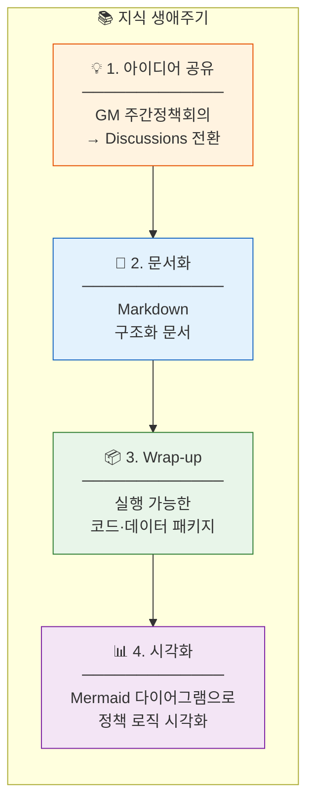

## 시작하기

GitHub 조직에서 프로젝트를 탐색하고 기여하며 협력하세요:

🔗 **[github.com/durume/GM](https://github.com/durume/GM)**

## 기여하기

시민, 개발자, 디자이너, 정책 관심자 모두의 참여를 환영합니다:

1. 공개된 [Issues](https://github.com/durume/GM/issues) 탐색
2. [Discussions](https://github.com/durume/GM/discussions) 참여
3. 개선사항 Pull Request 제출
4. Hack for Gwangmyeong 이벤트 참가

## 라이선스

이 프로젝트는 오픈소스입니다. 자세한 내용은 [LICENSE](LICENSE)를 참조하세요.

---

**지속 가능한 디지털 혁신 도시 광명 · 오픈소스 거버넌스 실행 전략**

*데이터, 코드, 시민 참여가 함께 흐르는 도시—사회적경제 혁신의 글로벌 모델을 만들어갑니다.*
