# Gwangmyeong City Open Source Governance Initiative

**Transforming Gwangmyeong into the Global Capital of Social and Solidarity Economy through Digital Innovation**

## Vision

Gwangmyeong City aims to become a globally recognized model for **Social and Solidarity Economy (SSE)** by leveraging exponential technologies—AI, open source governance, and citizen collaboration platforms—to accelerate **Digital Transformation (DX)** and **AI Transformation (AX)**.

## Highlights

| Achievement | Description |
|-------------|-------------|
| 🏆 **Prime Minister's Award** | 3 consecutive years of excellence in social economy policy evaluation (2025) |
| 📚 **45 Small Libraries** | Community-based digital literacy hubs across the city |
| 🤝 **Citizen Collaboration** | 100-person forums and GM Weekly Policy Meetings |
| 🌐 **durume/GM Knowledge Model** | Idea Sharing → Documentation → Wrap-up lifecycle |

## Why Open Source Governance?

| Benefit | Impact |
|---------|--------|
| 💸 **Budget Efficiency** | Zero licensing costs; reinvest savings in citizen welfare |
| 🔎 **Transparency & Trust** | Policy algorithms and metrics published as code |
| ♻️ **Reusability** | Other cities can fork successful solutions |
| 🗳️ **Citizen Sovereignty** | Citizens become policy co-producers |

## Global Benchmarks

### Public Sector
- 🇰🇷 **Korea NIA** - e-Government Standard Framework ([GitHub](https://github.com/eGovFramework))
- 🇬🇧 **UK GDS** - Government Design System ([GitHub](https://github.com/alphagov))
- 🇸🇬 **Singapore OGP** - FormSG, Isomer ([GitHub](https://github.com/opengovsg))
- 🇺🇸 **US code.gov** - Federal code inventory ([GitHub](https://github.com/GSA/code-gov))

### International Organizations
- **UNHCR** - AI-powered refugee support mapping
- **World Bank** - ietoolkit for impact evaluation ([GitHub](https://github.com/worldbank/ietoolkit))
- **Greenpeace** - Planet 4 citizen engagement platform ([GitHub](https://github.com/greenpeace/planet4))

## Strategic Projects

### 1. GM-Knowledge Repository
- Convert social economy education materials to public GitHub repositories
- Standardize Wrap-up reports with templates
- Visualize policy structures with Mermaid diagrams

### 2. G-SVI Open Data
- Publish measurement algorithms as open source
- Build impact dashboards (Singapore OGP benchmark)
- Provide self-diagnosis toolkits for social enterprises

### 3. Hack for Gwangmyeong
- Structure social enterprise challenges as GitHub Issues
- Run permanent hackathons with citizen developers
- Localize proven global open source tools

### 4. Digital Commons Asset Building
- Open source community platform code
- Share administrative solutions via InnerSource
- Link digital assets to local circular economy

## 6 Matching Projects

| Project | Local Assets | Tools | Expected Impact |
|---------|-------------|-------|-----------------|
| **GitHub Townhall** | 100-person forums, GM Weekly Meetings | Decidim | Policy deliberation via PR/Merge |
| **Gwangmyeong Food-Loop** | Sharing resources, Local food markets | FoodCoopShop, Komunitin | Real-time donation dashboard |
| **Open Gwangmyeong Tour** | Gwangmyeong Cave, Gihyeongdo Literature Museum | Arches, GitHub Pages | Auto-deploy citizen stories |
| **Mutual Growth Data Hub** | GM brand products, Sharing platform | Open API | Accelerate local business innovation |
| **Open Social Impact Analytics** | G-SVI metrics, Consulting data | World Bank ietoolkit | Automate social value calculations |
| **Autonomy Playbook** | Gwangmyeong Autonomy University projects | durume/GM templates | Policy manuals for other cities |

## Job Creation Revolution: From Applying to Creating

### The Paradigm Shift

> **Stop applying for jobs. Start creating them.**

The traditional employment model is obsolete. Instead of competing for shrinking positions at big tech companies, we empower citizens to **create their own jobs** by building socially needed services—powered by AI.

### Why This Changes Everything

| Old Paradigm | New Paradigm |
|--------------|--------------|
| Apply for existing jobs | Create jobs that didn't exist |
| Wait for companies to hire | Build services communities need |
| Limited by lack of resources | Empowered by AI superpowers |
| Compete against thousands | Solve unique local problems |
| Work for corporate profit | Create social value |

### AI as the Great Equalizer

Previously, creating meaningful services required:
- Large development teams
- Significant capital investment
- Years of accumulated expertise
- Corporate infrastructure

**Now, with AI superpowers, one person can:**
- Build applications that once required 10 developers
- Create professional designs without design training
- Write documentation in multiple languages instantly
- Automate complex workflows in hours, not months
- Prototype and iterate at unprecedented speed

### Unlocking Previously Impossible Services

AI enables us to tackle social needs that were **too resource-intensive to attempt before**:

| Social Need | Why It Was Hard | How AI Makes It Possible |
|-------------|-----------------|--------------------------|
| **Elderly Care Coordination** | Required 24/7 staff, complex scheduling | AI-powered matching, automated check-ins, predictive health alerts |
| **Multilingual City Services** | Expensive translation, limited languages | Real-time translation for 100+ languages |
| **Small Business Support** | One-on-one consulting too costly | AI advisors providing personalized guidance at scale |
| **Environmental Monitoring** | Sensor networks, data scientists needed | Low-cost sensors + AI analysis = actionable insights |
| **Accessibility Services** | Specialized expertise, custom solutions | AI-generated accommodations, real-time assistance |
| **Mental Health Support** | Shortage of professionals | AI-assisted screening, 24/7 crisis resources, therapist matching |

### The Job Creation Cycle

```mermaid
flowchart TD
    A[🔍 IDENTIFY SOCIAL NEEDS<br/>What services does our community lack?] --> B[🤖 BUILD WITH AI SUPERPOWERS<br/>One person + AI = capabilities of a full team]
    B --> C[📦 DEPLOY AS OPEN SOURCE<br/>Share freely, let others adapt and improve]
    C --> D[💼 CREATE SUSTAINABLE JOBS<br/>Maintain, support, train, expand the service]
    D --> E[🌍 SCALE & REPLICATE<br/>Other cities fork → More jobs created everywhere]
    E -.->|Cycle continues| A

    style A fill:#e1f5fe,stroke:#01579b
    style B fill:#f3e5f5,stroke:#4a148c
    style C fill:#e8f5e9,stroke:#1b5e20
    style D fill:#fff3e0,stroke:#e65100
    style E fill:#fce4ec,stroke:#880e4f
```

### New Types of Jobs We Can Create

**Service Creators**
- Identify unmet community needs
- Design and build AI-powered solutions
- Launch and iterate based on citizen feedback

**AI-Human Bridge Workers**
- Help citizens interact with AI services
- Ensure AI outputs are accurate and appropriate
- Provide the human touch where it matters

**Open Source Maintainers**
- Keep community services running smoothly
- Merge contributions from citizen developers
- Document and teach others to contribute

**Social Impact Analysts**
- Measure the real-world effects of services
- Identify new opportunities for impact
- Connect data to policy recommendations

**Community Tech Educators**
- Train citizens to use new services
- Teach others to become creators themselves
- Bridge the digital divide with human connection

### From Job Seekers to Job Creators

| Traditional Path | Gwangmyeong Path |
|------------------|------------------|
| Graduate → Apply → Wait → Reject/Accept | Graduate → Identify Need → Build → Launch → Employ Others |
| Success = Getting hired | Success = Creating value |
| Career depends on employers | Career depends on community impact |
| Skills must match job listings | Skills grow to match social needs |

### Expected Outcomes

- **Diverse job creation** in areas previously considered "not viable"
- **Social services explosion** - tackle problems we couldn't afford to solve before
- **Youth empowerment** - from job seekers to job creators
- **Community resilience** - locally-owned solutions for local problems
- **Innovation culture** - citizens see themselves as builders, not consumers
- **Global model** - other cities replicate Gwangmyeong's approach

---

## Community Wealth Building & Social Economy Ecosystem

### From Open Source to Sustainable Social Enterprise

Open source projects don't have to remain free forever. Through **social crowd funding**, successful projects can transition to sustainable social enterprises that hire local citizens and build community wealth.

### The Open Source → Social Enterprise Pipeline

```mermaid
flowchart TD
    subgraph P1[" "]
        A1[📖 PHASE 1: OPEN SOURCE DEVELOPMENT]
        A2[• Build with AI superpowers<br/>• Community contributes and improves<br/>• Validate demand through real usage]
    end

    subgraph P2[" "]
        B1[💰 PHASE 2: SOCIAL CROWD FUNDING]
        B2[• Citizens invest in projects they believe in<br/>• Local businesses sponsor community solutions<br/>• Government matches community investment]
    end

    subgraph P3[" "]
        C1[🏢 PHASE 3: SOCIAL ENTERPRISE FORMATION]
        C2[• Transition to cooperative or social enterprise model<br/>• Hire local citizens as employees<br/>• Maintain open source core, add premium services]
    end

    subgraph P4[" "]
        D1[🔄 PHASE 4: COMMUNITY WEALTH CIRCULATION]
        D2[• Profits reinvested in community<br/>• New projects funded from success<br/>• Wealth stays local, grows local]
    end

    P1 --> P2 --> P3 --> P4

    style A1 fill:#e3f2fd,stroke:#1565c0,font-weight:bold
    style B1 fill:#f1f8e9,stroke:#558b2f,font-weight:bold
    style C1 fill:#fff8e1,stroke:#ff8f00,font-weight:bold
    style D1 fill:#fce4ec,stroke:#c2185b,font-weight:bold
```

### Alignment with Gwangmyeong CWB Policy

Gwangmyeong City's Community Wealth Building (CWB) policy focuses on keeping economic benefits within the local community. Our open source approach directly supports this:

| CWB Principle | Open Source Implementation |
|---------------|---------------------------|
| **Local Ownership** | Projects owned by community cooperatives, not outside corporations |
| **Local Employment** | Hire Gwangmyeong residents to maintain and expand services |
| **Local Procurement** | Social enterprises purchase from local suppliers |
| **Local Investment** | Crowd funding keeps investment capital in the community |
| **Local Circulation** | Revenue cycles back through local economy via 광명사랑화폐 |

### Social Economy Service Examples

#### 1. Fair Trade Network Platform
- **Open Source Base**: Transparent marketplace code anyone can audit
- **Social Enterprise**: Cooperative-run platform connecting local producers and consumers
- **Jobs Created**: Platform managers, delivery coordinators, quality inspectors
- **CWB Impact**: Direct producer-to-consumer sales, fair pricing, local currency integration

#### 2. Social Economy Map & Network (GM 사회적경제 지도)
- **Open Source Base**: Interactive map showing all social enterprises, cooperatives, and community organizations
- **Features**:
  - Discover social enterprises by category, location, or mission
  - Network and collaborate between organizations
  - Track community impact metrics
  - Find fair trade products and services nearby
- **Social Enterprise**: Map maintenance, data verification, networking events
- **Jobs Created**: Data curators, community liaisons, event organizers

#### 3. Local Currency Integration (광명사랑화폐 연동)
- **Open Source Base**: API connecting social economy services with local currency
- **Social Enterprise**: Transaction processing, merchant onboarding
- **Jobs Created**: Technical support, merchant relations, fraud prevention
- **CWB Impact**: Every transaction strengthens local economic circulation

#### 4. Cooperative Delivery Network
- **Open Source Base**: Route optimization and delivery management system
- **Social Enterprise**: Worker-owned delivery cooperative
- **Jobs Created**: Delivery workers (fair wages, benefits), dispatchers
- **CWB Impact**: Competes with gig economy platforms while treating workers fairly

#### 5. Community Care Matching
- **Open Source Base**: AI-powered matching for elderly care, childcare, tutoring
- **Social Enterprise**: Care worker cooperative
- **Jobs Created**: Care workers, coordinators, trainers
- **CWB Impact**: Quality care jobs stay in community, profits reinvested locally

### Social Crowd Funding Model

| Funding Source | Role | Benefit |
|----------------|------|---------|
| **Citizens** | Micro-investments in local projects | Ownership stake, voting rights, community pride |
| **Local Businesses** | Sponsorship and B2B partnerships | Access to community-built solutions, local goodwill |
| **Social Enterprises** | Revenue sharing from successful projects | Sustainable funding for new initiatives |
| **Government** | Matching funds, infrastructure support | Multiplied impact of citizen investment |
| **광명사랑화폐** | Local currency investment option | Strengthens local currency ecosystem |

### Governance: Community-Owned, Community-Governed

```mermaid
flowchart TD
    subgraph owners[COMMUNITY OWNERSHIP STRUCTURE]
        direction TB
        C[👥 Citizens<br/>투자자]
        W[👷 Workers<br/>노동자]
        B[🏪 Local Biz<br/>파트너]

        C --> Board
        W --> Board
        B --> Board

        Board[🏛️ Cooperative Board<br/>협동조합 이사회]
        Board --> SE[🚀 Social Enterprise<br/>Operations]
    end

    style C fill:#e3f2fd,stroke:#1565c0
    style W fill:#fff3e0,stroke:#e65100
    style B fill:#e8f5e9,stroke:#2e7d32
    style Board fill:#f3e5f5,stroke:#7b1fa2
    style SE fill:#fce4ec,stroke:#c2185b
```

### Expected CWB Outcomes

- **Local Job Creation**: 50+ sustainable jobs per successful social enterprise
- **Wealth Retention**: 80%+ of revenue circulates within Gwangmyeong
- **Community Investment**: Citizens become stakeholders, not just consumers
- **Fair Economy**: Alternative to extractive platform capitalism
- **Replicable Model**: Other cities can fork both code AND business model

---

## Standing Committee: Agile & Lean Startup Execution

### Why a Standing Committee?

To transform Gwangmyeong into the global capital of Social and Solidarity Economy, we need a dedicated team that can **learn fast, design smart, and execute continuously**. Traditional government project cycles are too slow for the pace of exponential technology.

### Committee Mission

> "Accelerate Gwangmyeong's digital and social economy transformation through rapid experimentation, validated learning, and continuous iteration."

### Agile & Lean Startup Philosophy

| Principle | Application |
|-----------|-------------|
| **Build-Measure-Learn** | Launch MVPs quickly, gather citizen feedback, iterate rapidly |
| **Validated Learning** | Test assumptions before full investment; fail fast, learn faster |
| **Pivot or Persevere** | Data-driven decisions on whether to continue, change, or stop projects |
| **Continuous Deployment** | Regular releases, not annual projects; always improving |
| **Cross-functional Teams** | Citizens, developers, public servants, social enterprises working together |

### Committee Structure

```mermaid
flowchart TD
    subgraph committee[STANDING COMMITTEE STRUCTURE]
        direction TB

        subgraph steering[STEERING BOARD]
            S1[🏛️ Mayor's Office]
            S2[💼 Social Economy Center]
            S3[💡 Tech Advisors]
        end

        subgraph core[CORE COMMITTEE]
            C1[Product Owner - City Representative]
            C2[Scrum Master - Process Facilitator]
            C3[Tech Lead - Open Source & AI Expert]
            C4[Community Lead - Citizen Engagement]
            C5[Social Economy Lead - CWB & Cooperative Expert]
        end

        subgraph squads[PROJECT SQUADS]
            SA[🛒 Squad A<br/>Fair Trade Platform]
            SB[🗺️ Squad B<br/>Social Map & Network]
            SC[❤️ Squad C<br/>Care Match System]
        end

        subgraph contributors[CITIZEN CONTRIBUTORS]
            CC1[🎓 AI Docents]
            CC2[💻 Local Developers]
            CC3[🚀 Social Entrepreneurs]
        end

        steering --> core
        core --> squads
        squads --> contributors
    end

    style steering fill:#e8eaf6,stroke:#3f51b5
    style core fill:#e3f2fd,stroke:#1976d2
    style squads fill:#e8f5e9,stroke:#388e3c
    style contributors fill:#fff8e1,stroke:#ffa000
```

### Lean Startup Cycle for Each Project

```mermaid
flowchart LR
    subgraph cycle[BUILD-MEASURE-LEARN CYCLE]
        IDEAS[💡 IDEAS] --> BUILD[🔨 BUILD] --> PRODUCT[📦 PRODUCT]
        PRODUCT --> MEASURE[📊 MEASURE]
        MEASURE --> FEEDBACK[👥 CITIZEN<br/>FEEDBACK]
        FEEDBACK --> ANALYZE[🔍 ANALYZE]
        ANALYZE --> DATA[📈 DATA]
        DATA --> LEARN[🧠 LEARN]
        LEARN --> IDEAS
    end

    style IDEAS fill:#fff3e0,stroke:#e65100
    style BUILD fill:#e3f2fd,stroke:#1565c0
    style PRODUCT fill:#e8f5e9,stroke:#2e7d32
    style MEASURE fill:#f3e5f5,stroke:#7b1fa2
    style FEEDBACK fill:#fce4ec,stroke:#c2185b
    style ANALYZE fill:#e0f2f1,stroke:#00695c
    style DATA fill:#ede7f6,stroke:#4527a0
    style LEARN fill:#fff8e1,stroke:#ff8f00
```

### Sprint Rhythm

| Cycle | Duration | Activities |
|-------|----------|------------|
| **Daily Standup** | 15 min | Quick sync, blockers, progress |
| **Weekly Sprint** | 1 week | Build & ship incremental features |
| **Bi-weekly Demo** | 2 weeks | Show progress to citizens, gather feedback |
| **Monthly Retrospective** | 1 month | What worked, what didn't, how to improve |
| **Quarterly Review** | 3 months | Major milestones, pivot decisions, roadmap update |

### Minimum Viable Product (MVP) Approach

Instead of spending years on perfect solutions, we launch MVPs:

| Project | MVP (Week 1-4) | V1.0 (Month 2-3) | Scale (Month 4+) |
|---------|----------------|------------------|------------------|
| **Social Economy Map** | Static map with 50 entries | Interactive search, basic networking | Full platform with events, reviews |
| **Fair Trade Platform** | Simple order form + spreadsheet | Basic e-commerce with local currency | Full marketplace with delivery |
| **Care Matching** | Google Form + manual matching | AI-assisted matching prototype | Full cooperative operation |

### Learning Loops

**Weekly Learning Sessions**
- Tech tutorials (GitHub, AI tools, open source)
- Case studies from global social economy innovations
- Citizen feedback analysis and insights

**Monthly Workshops**
- Lean Startup methodology training
- Design thinking for social services
- Open source contribution practices

**Quarterly Hackathons**
- "Hack for Gwangmyeong" events
- Rapid prototyping of citizen ideas
- Demo day with city leadership

### Key Performance Indicators (KPIs)

| Category | Metric | Target |
|----------|--------|--------|
| **Speed** | Time from idea to MVP | < 4 weeks |
| **Learning** | Citizen feedback sessions per project | 10+ per month |
| **Iteration** | Releases per project per month | 4+ (weekly) |
| **Adoption** | Active users per service | 1,000+ in 6 months |
| **Employment** | Local jobs created | 10+ per successful project |
| **Sustainability** | Projects reaching crowd funding | 3+ per year |

### Decision Framework: Pivot or Persevere

After each quarterly review, projects are evaluated:

```mermaid
flowchart TD
    Q1{🤔 Is there validated<br/>citizen demand?}

    Q1 -->|YES| Q2{Is the solution<br/>working?}
    Q1 -->|NO| Q3{Is the problem<br/>worth solving?}

    Q2 -->|YES| P1[✅ PERSEVERE<br/>Scale up, seek funding]
    Q2 -->|NO| P2[🔄 PIVOT<br/>Change solution, keep problem]

    Q3 -->|YES| P3[🔄 PIVOT<br/>Reframe problem, new approach]
    Q3 -->|NO| P4[🛑 STOP<br/>Archive learnings, move on]

    style Q1 fill:#fff3e0,stroke:#e65100
    style Q2 fill:#e3f2fd,stroke:#1565c0
    style Q3 fill:#f3e5f5,stroke:#7b1fa2
    style P1 fill:#c8e6c9,stroke:#2e7d32
    style P2 fill:#fff9c4,stroke:#f9a825
    style P3 fill:#fff9c4,stroke:#f9a825
    style P4 fill:#ffcdd2,stroke:#c62828
```

### Committee Commitments

1. **Transparency**: All work in public GitHub repositories
2. **Inclusion**: Citizen participation in every decision
3. **Speed**: Ship something every week
4. **Learning**: Failure is data, not defeat
5. **Impact**: Measure real outcomes, not just outputs

---

## AI Docent Program

Training citizen digital guides to bridge the digital divide:

### Mission
> "AI Docents create a society where everyone can safely and fairly utilize AI, collaborating with local communities to promote AI understanding, responsible use, and digital inclusion."

### Training Process
1. **Learning with AI** - Generative AI, GitHub basics, document creation
2. **Teaching with AI** - Create infographics, develop explanation skills
3. **Practice & Certification** - Field practice → Official Gwangmyeong AI Docent certification

### Core Goals
- 📚 AI Literacy Enhancement
- ⚖️ Responsible AI Usage
- 🤝 Social Solidarity
- 🌈 Digital Divide Elimination

## Small Libraries: The Key to Sustainable Citizen Engagement

### Why Small Libraries Are the Heart of This Project

> **The key to making this project sustainable and vital is citizen engagement. Small libraries are the neighborhood hubs for social transformation.**

Gwangmyeong's 45 small libraries (작은도서관) are not just places to borrow books—they are **trusted community anchors** in every neighborhood. They already have:
- Physical space for gathering
- Trusted relationships with residents
- Librarians who know their communities
- A mission of public education and access

Now we transform them into **full-service innovation hubs** for education, training, building, and community wealth creation.

### The Small Library Transformation

```mermaid
flowchart LR
    subgraph hub[🏛️ SMALL LIBRARY: NEIGHBORHOOD INNOVATION HUB]
        direction TB

        subgraph journey[CITIZEN JOURNEY]
            direction LR
            L[📚 LEARN<br/>AI Literacy<br/>Digital Skills<br/>Open Source]
            T[🎓 TRAIN<br/>GitHub Workshops<br/>AI Docent<br/>Certification]
            B[🔨 BUILD<br/>Prototype Sessions<br/>Hackathons<br/>Co-creation]
            LA[🚀 LAUNCH<br/>MVP Demos<br/>Crowd Funding]

            L --> T --> B --> LA
        end

        subgraph services[COMMUNITY SERVICES]
            S1[🤝 Neighbor-to-neighbor tech support]
            S2[🔍 Local issue identification & solution design]
            S3[🌱 Social enterprise incubation]
            S4[👴👶 Intergenerational knowledge exchange]
        end
    end

    style L fill:#e3f2fd,stroke:#1565c0
    style T fill:#f3e5f5,stroke:#7b1fa2
    style B fill:#fff3e0,stroke:#e65100
    style LA fill:#e8f5e9,stroke:#2e7d32
```

### Full-Service Innovation Hub Model

#### 1. LEARN: Digital Literacy for All
| Program | Target Audience | Content |
|---------|-----------------|---------|
| **AI First Steps** | Seniors, beginners | What is AI? Safe usage, practical applications |
| **Digital Citizenship** | All ages | Online safety, information literacy, digital rights |
| **Open Source 101** | Curious citizens | What is open source? Why does it matter? |
| **GitHub for Everyone** | Non-programmers | GUI-based contribution, issue reporting |

#### 2. TRAIN: Building Skills & Certifications
| Program | Duration | Outcome |
|---------|----------|---------|
| **AI Docent Bootcamp** | 8 weeks | Certified community AI guide |
| **Open Source Contributor** | 4 weeks | First GitHub contribution |
| **Social Service Designer** | 6 weeks | Prototype a community solution |
| **Cooperative Leadership** | 4 weeks | Ready to launch social enterprise |

#### 3. BUILD: Co-Creation & Prototyping
- **Weekly Build Sessions**: Residents work together on local projects
- **Neighborhood Hackathons**: 24-hour intensive problem-solving events
- **Youth-Senior Pairing**: Intergenerational teams combine wisdom and tech skills
- **MVP Workshops**: Turn ideas into working prototypes in one weekend

#### 4. LAUNCH: From Idea to Impact
- **Demo Days**: Present projects to community and city officials
- **Crowd Funding Campaigns**: Launch local investment drives
- **Social Enterprise Formation**: Graduate from library to cooperative
- **Ongoing Support**: Library remains the home base even after launch

### The Librarian as Innovation Facilitator

Librarians transform from book managers to **community innovation catalysts**:

| Traditional Role | New Role |
|------------------|----------|
| Lending books | Facilitating learning journeys |
| Quiet study space | Collaborative creation space |
| Information lookup | Problem-solving guidance |
| Individual service | Community building |
| Passive resource | Active innovation partner |

### Network Effect: 45 Libraries = 45 Innovation Nodes

```mermaid
flowchart TD
    subgraph network[🌐 GWANGMYEONG INNOVATION NETWORK]
        direction TB

        subgraph row1[" "]
            direction LR
            L1[🏛️] --- L2[🏛️] --- L3[🏛️] --- L4[🏛️] --- L5[🏛️]
        end

        subgraph row2[" "]
            direction LR
            L6[🏛️] --- L7[🏛️] --- L8[🏛️] --- L9[🏛️] --- L10[🏛️]
        end

        subgraph row3[" "]
            direction LR
            L11[🏛️] --- L12[🏛️] --- L13[🏛️] --- L14[🏛️] --- L15[🏛️]
        end

        row1 --- row2 --- row3

        row3 --> GH[📦 Central GitHub Repository<br/>durume/GM]

        subgraph benefits[KEY BENEFITS]
            B1[✅ 45 Small Libraries = 45 Innovation Hubs]
            B2[✅ City-wide Coverage]
            B3[✅ No Citizen Left Behind]
            B4[✅ Solutions spread across the network]
        end
    end

    style GH fill:#24292e,stroke:#fff,color:#fff
    style benefits fill:#e8f5e9,stroke:#2e7d32
```

### Why This Makes the Project Sustainable

| Challenge | How Small Libraries Solve It |
|-----------|------------------------------|
| **Reaching all citizens** | Libraries are in every neighborhood, already trusted |
| **Continuous engagement** | Not one-time events, but ongoing programs |
| **Intergenerational participation** | Natural gathering place for all ages |
| **Low barrier to entry** | Free, familiar, non-intimidating environment |
| **Local ownership** | Each library reflects its neighborhood's needs |
| **Volunteer base** | Library volunteers become innovation ambassadors |
| **Physical + Digital** | Bridge between online tools and offline community |

### Citizen Journey Through the Library Network

```mermaid
flowchart LR
    subgraph journey[🚀 CITIZEN JOURNEY - All at your local Small Library]
        C[🔍 CURIOUS<br/>CITIZEN<br/>───────<br/>Attends first<br/>workshop] --> L[📖 LEARNER<br/>───────<br/>Takes courses<br/>Gets certified]
        L --> B[🔨 BUILDER<br/>───────<br/>Joins build<br/>sessions &<br/>hackathons]
        B --> CR[💡 CREATOR<br/>───────<br/>Launches own<br/>project, forms<br/>cooperative]
        CR --> LE[👑 LEADER<br/>───────<br/>Mentors others<br/>Leads social<br/>enterprise]
    end

    style C fill:#e3f2fd,stroke:#1565c0
    style L fill:#e8f5e9,stroke:#2e7d32
    style B fill:#fff3e0,stroke:#e65100
    style CR fill:#f3e5f5,stroke:#7b1fa2
    style LE fill:#fce4ec,stroke:#c2185b
```

### Measuring Library Impact

| Metric | Target (Year 1) |
|--------|-----------------|
| Libraries activated as innovation hubs | 45 (100%) |
| Citizens participating in programs | 5,000+ |
| AI Docents certified | 200+ |
| Projects incubated | 50+ |
| Social enterprises launched | 10+ |
| Jobs created through library network | 100+ |

---

## Saving Young Minds: An Alternative to Online Radicalization

### The Hidden Crisis

Young men are increasingly exposed to far-right ideologies through:
- **Gaming communities** where extremist views spread unchecked
- **Algorithmic echo chambers** that feed short-form clips designed to radicalize
- **Online spaces** that offer belonging but lead to isolation and resentment
- **Lack of purpose** that makes extremist narratives appealing

This is not just a political problem—it's a **mental health crisis** and a **social emergency**.

### Why This Happens

| What Young Men Seek | What Algorithms Provide | What They Actually Need |
|---------------------|------------------------|------------------------|
| Belonging | Toxic online communities | Real-world connection |
| Purpose | Rage and grievance narratives | Meaningful contribution |
| Mastery | Endless consumption loops | Actual skill building |
| Recognition | Likes and engagement metrics | Genuine achievement |
| Identity | Us-vs-them tribalism | Positive role in community |

### How This Project Provides a Healthy Alternative

```mermaid
flowchart TD
    subgraph comparison[TOXIC ALGORITHM PATH vs. COMMUNITY BUILDER PATH]
        direction LR

        subgraph toxic[❌ ALGORITHM PATH]
            direction TB
            T1[😐 Boredom] --> T2[🎮 Gaming/Social Media]
            T2 --> T3[📱 Algorithmic Radicalization]
            T3 --> T4[🔒 Echo Chamber Isolation]
            T4 --> T5[😠 Resentment & Anger]
            T5 --> T6[💀 Extremist Worldview]
            T6 --> T7[😔 Social Isolation]
            T7 --> T8[💔 Mental Health Crisis]
        end

        subgraph healthy[✅ GWANGMYEONG PATH]
            direction TB
            H1[😐 Boredom] --> H2[📚 Local Library Workshop]
            H2 --> H3[🤖 Learn AI & Open Source]
            H3 --> H4[👥 Join Build Sessions]
            H4 --> H5[💡 Create Real Solutions]
            H5 --> H6[🚀 Launch Social Enterprise]
            H6 --> H7[🌟 Community Leadership]
            H7 --> H8[💚 Purpose & Healthy Identity]
        end
    end

    style T8 fill:#ffcdd2,stroke:#c62828
    style H8 fill:#c8e6c9,stroke:#2e7d32
    style toxic fill:#ffebee,stroke:#e53935
    style healthy fill:#e8f5e9,stroke:#43a047
```

### What We Offer Instead of Algorithms

| Toxic Online Offers | Our Project Offers |
|--------------------|-------------------|
| **Fake mastery** (gaming ranks) | **Real mastery** (building working apps) |
| **Parasocial relationships** | **Actual friendships** with fellow builders |
| **Outrage content** | **Constructive problem-solving** |
| **Passive consumption** | **Active creation** |
| **Virtual achievements** | **Tangible community impact** |
| **Anonymous trolling** | **Public recognition** for contributions |
| **Grievance narratives** | **Empowerment through action** |
| **Doomscrolling** | **Skill progression** |

### The Psychological Shift

**From:** "The world is against me, and I'm powerless"
**To:** "I can build things that help my community, and people value my contributions"

This shift addresses the core psychological needs that make young men vulnerable to radicalization:

1. **Agency**: "I can create, not just consume"
2. **Competence**: "I'm building real skills that matter"
3. **Belonging**: "I'm part of a team solving real problems"
4. **Purpose**: "My work helps my neighbors"
5. **Recognition**: "My contributions are visible and valued"

### Specific Programs for At-Risk Youth

| Program | Description | Psychological Benefit |
|---------|-------------|----------------------|
| **Game Dev for Good** | Use gaming skills to build civic apps | Channel existing interests constructively |
| **Youth-Senior Pairing** | Team up with elders on projects | Break echo chambers, gain perspective |
| **Hack for Gwangmyeong** | Competitive hackathons with real prizes | Healthy competition with positive outcomes |
| **Open Source Mentorship** | Senior developers guide beginners | Positive male role models |
| **Social Enterprise Incubator** | Turn ideas into real businesses | Ownership and responsibility |
| **Community Recognition** | Public celebration of contributions | Healthy status and identity |

### Why Open Source Culture is Antidote to Extremism

Open source values directly counter extremist ideology:

| Extremist Values | Open Source Values |
|------------------|-------------------|
| Us vs. Them | Global collaboration |
| Zero-sum competition | Abundance mindset (share & grow) |
| Blame others | Take responsibility (commit your code) |
| Destruction | Construction |
| Secrecy & conspiracy | Transparency & openness |
| Hierarchy by force | Meritocracy of contribution |
| Tribalism | Universal community |

### The Library as Safe Space

Small libraries provide what online spaces cannot:

- **Physical presence** breaks the screen addiction cycle
- **Face-to-face interaction** develops real social skills
- **Intergenerational contact** provides perspective and wisdom
- **Librarian mentorship** offers trusted adult guidance
- **Structured programs** replace endless scrolling with purposeful activity
- **Local focus** connects abstract skills to tangible community benefit

### Measuring Success: Mental Health & Social Integration

| Indicator | What We're Watching |
|-----------|-------------------|
| **Engagement shift** | Time spent building vs. consuming |
| **Social connections** | New friendships formed through programs |
| **Skill development** | Certifications earned, projects completed |
| **Community contribution** | Issues solved, services launched |
| **Mental health** | Self-reported purpose and belonging |
| **Career trajectory** | Employment, entrepreneurship, education |

### A Message to Young Men

> **You have skills. You have energy. You have ideas.**
>
> The algorithms want to harvest your attention and sell your anger.
>
> **We want to help you build things that matter.**
>
> Your gaming skills can become app development skills.
> Your online community can become a real-world team.
> Your frustration can become fuel for solving actual problems.
>
> **Come to your local library. Learn to code. Build something real. Change your neighborhood.**
>
> That's power. Real power. Not the fake power of online rage.

---

## Citizen Engagement Strategy

### Step 1: Small Library Digital Hubs
Transform 45 small libraries into full-service innovation centers with comprehensive programs from basic literacy to social enterprise launch

### Step 2: GitHub for Non-programmers
GUI-focused education using web interface and GitHub Desktop, with librarians as guides

### Step 3: Hackathons & Showcases
Regular "Hack for Gwangmyeong" events hosted across the library network, connecting citizen issues to real-time solutions

---

## durume/GM Knowledge Lifecycle

```mermaid
flowchart LR
    subgraph lifecycle[📚 KNOWLEDGE LIFECYCLE]
        I[💡 1. Idea Sharing<br/>─────────────<br/>GM Weekly Meetings<br/>→ Discussions] --> D[📄 2. Documents<br/>─────────────<br/>Markdown structured<br/>documentation]
        D --> W[📦 3. Wrap-up<br/>─────────────<br/>Executable code<br/>+ data packages]
        W --> V[📊 4. Visualization<br/>─────────────<br/>Mermaid diagrams<br/>for policy logic]
    end

    style I fill:#fff3e0,stroke:#e65100
    style D fill:#e3f2fd,stroke:#1565c0
    style W fill:#e8f5e9,stroke:#2e7d32
    style V fill:#f3e5f5,stroke:#7b1fa2
```

## Getting Started

Visit our GitHub organization to explore projects, contribute, and collaborate:

🔗 **[github.com/durume/GM](https://github.com/durume/GM)**

## Contributing

We welcome contributions from citizens, developers, designers, and policy enthusiasts:

1. Browse open [Issues](https://github.com/durume/GM/issues)
2. Join [Discussions](https://github.com/durume/GM/discussions)
3. Submit Pull Requests for improvements
4. Participate in Hack for Gwangmyeong events

## License

This project is open source. See [LICENSE](LICENSE) for details.

---

**Sustainable Digital Innovation City Gwangmyeong · Open Source Governance Execution Strategy**

*Building a city where data, code, and citizen participation flow together to create a global model for social economy innovation.*
